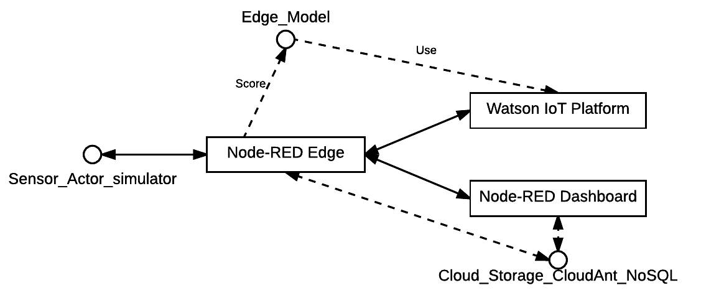

# Overview

This repository contains samples for a fast-track deployment of the Edge part of an IoT system based on NodeRED. 

This was originally part of a larger tutorial which can be found [HERE](https://ibm.biz/CognitiveIoT). This repository is used in the fast-track recipe which can be found [HERE](https://developer.ibm.com/recipes/tutorials/realtime-anomaly-detection-on-the-iot-edge-using-nodered-and-moving-zscore/). These are the steps:

* Deploy NodeRED + AnomalyDetector app to the cloud
* Configure Watson IoT Componenets
* Stream data into Watson IoT Platform
* Analyze Edge-based Anomaly Detector using moving zscore in NodeRED Dashboard

# Installation/Deployment Steps

Follow the fast-track recipe instructions [HERE](https://developer.ibm.com/recipes/tutorials/realtime-anomaly-detection-on-the-iot-edge-using-nodered-and-moving-zscore/) first, using the above "Deploy to Bluemix" button to automate a majority of the deployment. Afterward, you need to wire up the Watson IoT Platform to your simulated device.

## Setting up Watson IoT Components

There are a few steps required to wire up your Node-RED application to Watson IoT Platform. This gives a dashboard to see real-time values of your simulated sensor, as well as shows connectivity over time and values over time.

### Setting up the RemoteDevice Device Type in Watson IoT Platform

1) Go to the menu in Bluemix console
2) Select Apps
3) Select Dashboard
4) Select your App's Name (not route) (CognitiveIoT-<timestamp>)
5) Under "connections", select "cognitive-iot-iotf-service"
6) Under the "Welcome to Watson IoT Platform" text, click "Launch"
7) On the WIoT page, Click the microchip icon on the left-hand side. It is labeled "Devices"
8) Click the "+ Add Device" button on the right side.
9) Click the "Create device type" button.
9) Click the "Create device type" button on the next dialog as well.
10) On the "general information" dialog, enter the name "RemoteDevice", and click the "Next" button.
11) Let's skip this page, but this is where you'd fill in metadata about an actual physical device. Click "next".
12) Click "Next" again, then "Create"

### Setting up the VoltageSensor01 Device in Watson IoT Platform

Now that your device type is created, you will create a device.

1) Select "RemoteDevice" in the dropdown under "Add Device", and click the "Next" button.
2) For Device ID, put "VoltageSensor01". This matches details under the ibmiot out node in Node-RED, which you can investigate by double-clicking the node.
3) Continue to click the "Next" button, until you get to the Summary view, and then click "Add".
4) You will now have a view of details about your VoltageSensor01 device. Scroll down to "Recent Events" and you should see voltage events occurring continuously. Under "Sensor Information", you can see the most recent data being received, including voltage, frequency, count, and timestamp ('ts'). Click the 'x' to the upper-right to close this view.
5) On the upper-left, click the menu item called "Boards".
6) Click the "Device-Centric Analytics" board. You'll now see cards representing much of the same info we saw in the device details. However, this view is a dashboard to easily allow seeing multiple devices at the same time, and you could create additional cards to display further analytics.

# Runtime instructions (end user documentation)

After deployment, you can see the dashboard in Node-RED by navigating in the Node-RED interface to the "Dashboard" tab on the right-hand side, then clicking the "Open new window" button to the right of the "Site" tab within the "Dashboard" tab. Another option is to go to "http://<your bluemix base url>/ui/". For example, if your app's name is CognitiveIoT-20170101010000, then you'd be able to get to the dashboard via "http://CognitiveIoT-20170101010000.mybluemix.net/ui/".

The Node-RED dashboard shows a 1-minute visualization on your simulated Voltage sensor, as well as the moving Z-score. Any large jumps in Z-score are also reported in under "Alert Status".

# Performance/production considerations

In a production environment, you would run Node-RED on each of your edge devices, and wire each to Watson IoT Platform. There, you could monitor and manage all of them from a central dashboard.

# Extension considerations

For alerting, it you could run a Node-RED instance from BlueMix like above, and change only a few things to expand the Node-RED dashboard to show your other devices. 

Another option would be to run the dashboard on your edge devices themselves, and check per-device. This is probably less than optimal though.

# Architectural Diagram

### License
-----------------------

The project is shipped with Apache License and refer to the [License file](https://github.com/IBM/CognitiveIoT/blob/master/LICENSE) for more information about the licensing.

