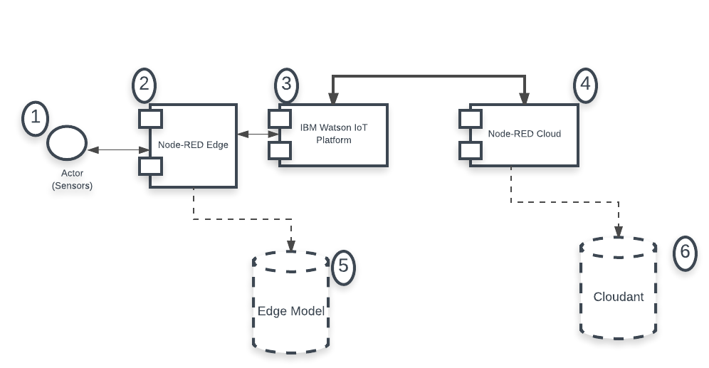
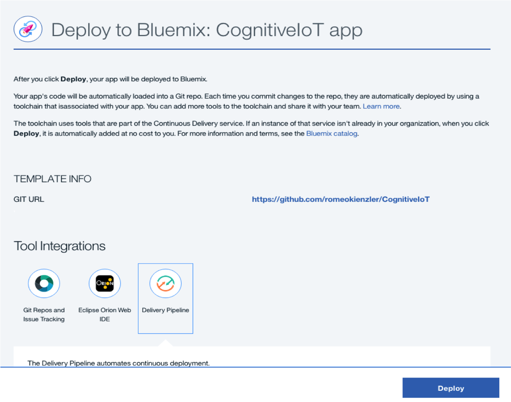
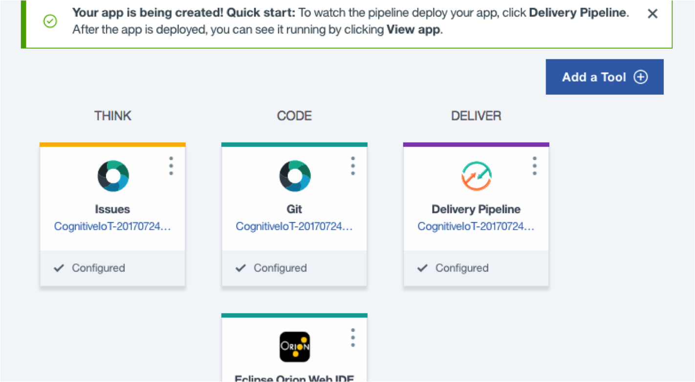
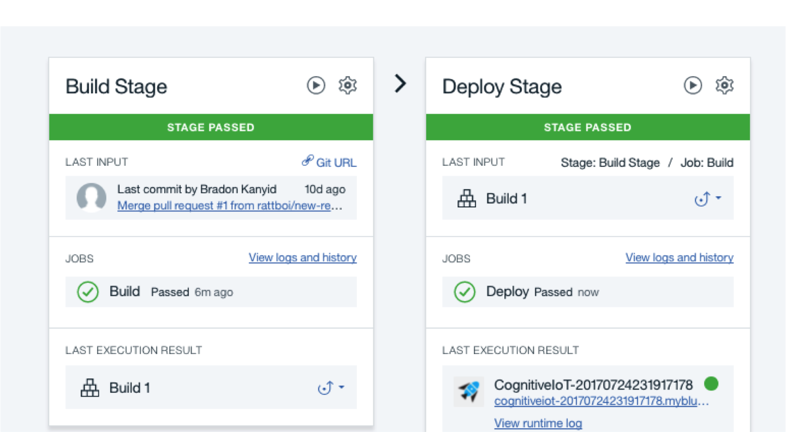
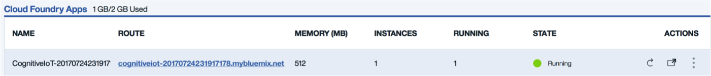
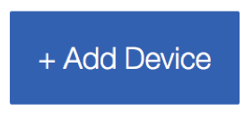
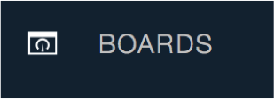
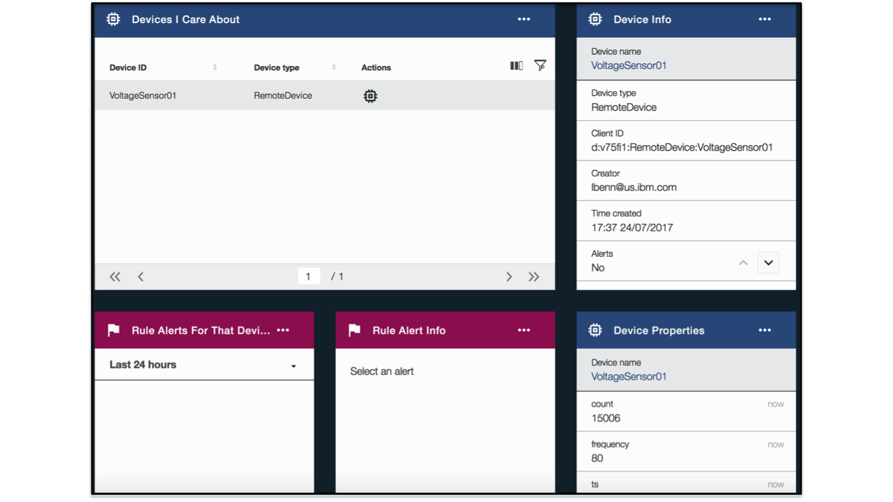

# Creating a Cognitive IOT Application that Monitors Household Devices

This Cognitive Journey demonstrates how to build a Cognitive IoT application. In cognitive IoT solutions, machine learning takes place in an edge computing architecture. Note that Edge computing means that you push computing away from the cloud or data center out towards the sensors. Computations happens on the edge gateway (e.g. Simulated Raspberry Pie in this scenario) near the sensors and actors. Let's use a simple scenario for illustration. Assume that you have a Washing Machine with 3 sensors.
* Fluid temperature
* Hardness of H2O
* Speed of the motor

One can use the sensors to monitor the washing machine for any abnormalities for these specific parts of the machine.  When any of these become unstable, information is triggered to perform an action and to record for later analytics processing.

## Application Workflow Diagram

## Flow

1. *Sensors*: The heart of every IOT solution is the sensors and actors. We sense the environment, make (cognitive) decisions, and act using actors. In the washing machine use case; the 3 sensors are 1) fluid temperature 2) hardness of H2O 3) Speed of the motor.  These sensors would be in the washing machine.
2. *Node-RED Edge*: edge means "it's near the device" which one manages; in this case that is the simulated Raspberry Pie; therefore it is called Node Red on the edge. Imagine the Raspberry Pie is attached to the washing machine. Data is flowing constantly from the sensors to the Raspberry Pie. The Node Red Edge (or Raspberry Pie) is hooked up to the Internet by ethernet and is streaming data to the Watson IoT Platform.
3. *Watson IoT Platform*: is only using the MQTT Message broker. It publishes data back to the Node Red Edge ( in a real world case, if it detects an anomaly,  it would send a message back to the machine to deactivate its motor)
4. *Node-RED Cloud*: There is a second Node-RED Cloud and it is subscribing to the data coming from the IoT Platform.  That data is then sent to Cloudant so batch analytics can be performed later.
5. *Cloudant*: A repository that is used for batch analytics processing to identify trends.

## Included Components
* [Node-Red Edge](https://flows.nodered.org/node/node-red-node-watson) Node-RED is a flow-based programming tool.
* [Watson IOT Platform](https://developer.ibm.com/iotplatform/)  Tools and services you need to connect, manage, analyze and secure IoT devices.
* [Cloudant](https://console.bluemix.net/docs/services/Cloudant/getting-started.html#getting-started-with-cloudant) IBM® Cloudant® is a managed NoSQL JSON database service

## Featured Technologies
* MQTT Message Broker
* Cloud
* IoT
* Node.js

# Steps

These are high-level steps:

* Deploy NodeRED + AnomalyDetector app to the cloud
* Configure Watson IoT Components
* Stream data into Watson IoT Platform
* Analyze Edge-based Anomaly Detector using moving zscore in NodeRED Dashboard

## Deploying the Application to Bluemix

A) **Using the Deploy to Bluemix button**

Clicking on the button will automatically deploy a NodeRED data flow tool acting as a device simulator in the IBM Cloud. It also creates a pre-configured "edge" implementation of the zScore algorithm.

The `Deploy to Bluemix` button automates a majority of the deployment. Afterward, you need to wire up the Watson IoT Platform to your simulated device.

1. We can see that the app is ready to be deployed, and we need to ensure that the App name, region, Organization, Space is valid before pressing 'Deploy'.

2. In Toolchain, the app is deployed. There is also an option to edit code via eclipseIDE, git changes if required.

3. You should see two stages pass successfully once your Deploy Stage completes

4. To see the app and services created and configured for this journey, use the Bluemix dashboard. The app is named `CognitiveIoT-20170724231917178` and it is running the following services:

  * [Cloudant NoSQL DB](https://console.bluemix.net/catalog/services/cloudant-nosql-db?env_id=ibm:yp:us-south)
  * [cognitive-iot-iotf-service](https://www.ibm.com/internet-of-things/platform/watson-iot-platform/)

B) **Go into Bluemix** and click on the url route associated with your application. you will be taken to the NodeRED flow editor where you can see the already deployed and running application.

Please have a look; you should see the following:

So let's walk you through each element:
1. NodeRED is free, Open Source and runs everywhere! In the IBM Cloud, in every other cloud or data center, on your laptop and even on an IoT Gateway like a Raspberry Pi. So consider this flow to run on an IoT Gateway connected to an elevator and measuring voltage for the main driver motor. As we don’t have a Raspberry Pi in place we are just simulating these sensor values using an “Inject” node in NodeRED. Otherwise you would see a dedicated sensor node here

2. In order to create some randomness this JavaScript function node adds some random noise to the signal and also occasionally adds an anomaly which we want to detect

3. In addition we want to send data upstream to the cloud so let’s add a time-stamp. It is always good to generate a time-stamp (temporally and spatially) as close as possible to the sensor. So this value can be referred to as “event time” rather than “processing time”

4. To stream these data to the IBM Watson IoT Platform via MQTT only one simple node is necessary

5. In addition we want to create a little dashboard to monitor the voltage sensor values

6. In order to achieve this we need to shift and shuffle the values a bit

7. Now we are at the heart of the system. This JavaScript function will actually calculate the moving z-score for us.

8. Of course we want to plot the moving z-score as well – in parallel to the voltage in order to really understand what’s going on

9. Again we need to do some shifting and shuffling as a preparation

10. Now we generate an alert messages in case the z-score drops below -0.5 which means some major fluctuation has been taken place recently

11. We just display this alert message under the two other charts

12. In order to get rid of the message once in a while we reset it

13. And delay the deletion 5s, so the message keeps displayed for 5s

C) **Observe what's going on** using the real-time dashboard: in order to open the dashboard just click on the dashboard tab and on the dashboard icon as shown here:

When you click on it, you will observe two time series charts, one for voltage and one for the moving z-score.

Wait for some time until you observe a z-score below -0.5 and you’ll see that an alert message is being generated. Of course you can also trigger something more important like initiate an emergency shutdown of the system or raise an alert, either by sending an email/SMS from the Edge directly using a NodeRED node (see twilio or email for this) or you can also send the alert upstream to the cloud using MQTT. The latter would be a perfect example on how Edge analytics can reduce the amount of data transferred to the cloud by adding intelligence to the Edge gateway device:

## Setting up your Bluemix Application with the Watson IoT Components

There are a few more steps required to wire up your Node-RED application to Watson IoT Platform. This gives you a dashboard that shows the real-time values of your simulated sensor, as well as shows connectivity over time and values over time.

## Setting up the RemoteDevice Device Type in Watson IoT Platform

Each device connected to the IBM Watson IoT Platform is associated with a device type. Device types are intended to be groups of devices which share common characteristics. So in order to add devices in IBM Watson IoT Platform, one need to create a device type. What you are actually doing is registering a device in the IBM Watson IoT Platform.

1) Go to the menu in Bluemix console

2) Select Apps

3) Select Dashboard

4) Select your App's Name (not route) (CognitiveIoT-<timestamp>)

5) Under "connections", select "cognitive-iot-iotf-service"

6) Under the "Welcome to Watson IoT Platform" text, click "Launch"

7) On the WIoT page, Click the microchip icon on the left-hand side. It is labeled "Devices"
 

    
  

8) Click the "+ Add Device" button on the right side.

   
 

9) Click the "Create device type" button.

10) Click the "Create device type" button on the next dialog as well.

11) On the "general information" dialog, enter the name "RemoteDevice", and click the "Next" button.

12) Let's skip this page, but this is where you'd fill in metadata about an actual physical device. Click "next".

13) Click "Next" again, then "Create"

## Setting up the VoltageSensor01 Device in Watson IoT Platform

Now that your device type is created, you will add the device to the IoT Platform. A device can be defined that has a connection to the internet and has data it wants to get into the cloud. And devices can accept commands from applications as well. You need to add the device in IBM Watson IoT Platform Organization before connecting it to the IoT.

1) Select "RemoteDevice" in the dropdown under "Add Device", and click the "Next" button.

2) For Device ID, put "VoltageSensor01". This matches details under the ibmiot out node in Node-RED, which you can investigate by double-clicking the node.

3) Continue to click the "Next" button, until you get to the Summary view, and then click "Add".

4) You will now have a view of details about your VoltageSensor01 device. Scroll down to "Recent Events" and you should see voltage events occurring continuously. Under "Sensor Information", you can see the most recent data being received, including voltage, frequency, count, and timestamp ('ts'). Click the 'x' to the upper-right to close this view.

5) On the upper-left, click the menu item called "Boards".

   
 

6) Click the "Device-Centric Analytics" board. You'll now see cards representing much of the same info we saw in the device details. However, this view is a dashboard to easily allow seeing multiple devices at the same time, and you could create additional cards to display further analytics.

   
 

# Performance/production considerations

In a production environment, you would run Node-RED on each of your edge devices, and wire each to Watson IoT Platform. There, you could monitor and manage all of them from a central dashboard.

# Extension considerations

For alerting, it you could run a Node-RED instance from BlueMix like above, and change only a few things to expand the Node-RED dashboard to show your other devices.

Another option would be to run the dashboard on your edge devices themselves, and check per-device. This is probably less than optimal though.

**Note:** This journey was originally part of a larger tutorial which can be found [HERE](https://developer.ibm.com/code/patterns/detect-voltage-anomalies-in-household-iot-devices/).

### License
-----------------------

The project is shipped with Apache License and refer to the [License file](https://github.com/IBM/CognitiveIoT/blob/master/LICENSE) for more information about the licensing.
